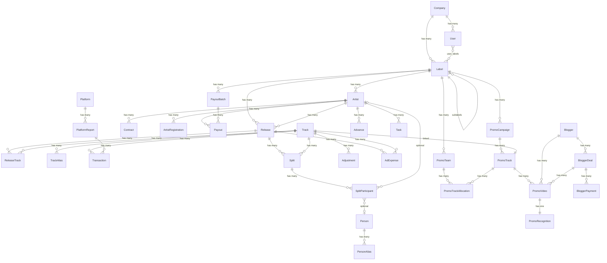

# Domain

Все бизнес-сущности системы, сгруппированные по областям.

---

## 1. Организация

### Company

Головная организация, которая владеет одним или несколькими лейблами. Точка входа для владельца бизнеса.

- Объединяет все лейблы под одним управлением
- Определяет общие настройки и доступы

Связи: has many Label, has many User.

### Label

Музыкальный лейбл или сублейбл. Самостоятельная бизнес-единица со своим каталогом, артистами и финансами. Может быть частью другого лейбла (сублейбл).

- Владеет каталогом релизов
- Подписывает артистов
- Получает доходы от платформ
- Несёт рекламные расходы

Связи: belongs to Company, may belong to Label (сублейбл), has many Artist, has many Release.

### User

Человек, работающий в системе. Имеет роль и привязку к одному или нескольким лейблам.

Роли:
- **Владелец** — полный доступ ко всем лейблам, финансам и настройкам
- **Менеджер лейбла** — управляет артистами, сплитами, договорами и задачами
- **Финансовый менеджер** — загружает отчёты платформ, формирует выплаты
- **Head of Marketing** — управляет промо-кампаниями, командами, бюджетами; видит всю аналитику
- **Промо тимлид** — руководит своей промо-командой, контролирует долг и сделки
- **Промо менеджер** — закупает рекламный контент у блогеров через Telegram бот

Связи: belongs to Company, связан с одним или несколькими Label, может быть team_lead или member в PromoTeam.

---

## 2. Каталог

### Artist

Музыкальный исполнитель, подписанный на лейбл. Может быть привязан к нескольким лейблам. Является также внешним пользователем системы (видит свои данные).

Артист может иметь статус «bought off rights» (выкупленные права) — такой артист исключается из регулярных роялти-выплат, потому что его права были выкуплены единоразово.

Артист имеет никнейм (сценическое имя) и юридическое имя (полное ФИО). Паблишинг-платформы (ASCAP, B17) используют юридическое имя, а не никнейм. Система должна уметь связывать оба. У некоторых артистов юридическое лицо — другой человек (например, родитель несовершеннолетнего).

Артист может быть несовершеннолетним (Minor) — это влияет на контракты и платёжные данные (контакт через родителя).

- Выпускает релизы
- Получает доход от стримингов
- Имеет баланс (доходы минус расходы минус выплаты)
- Предоставляет данные для регистрации и выплат
- Может быть исключён из выплат (bought off rights)
- Хранит никнейм, юридическое имя, и при необходимости контактное лицо (родитель)
- Может быть помечен как несовершеннолетний

Связи: belongs to Label (один или несколько), has many Release, has many Contract, has many Split (как участник), has many Transaction (через треки), has many Payout, has many ArtistRegistration.

### Release

Музыкальный релиз — сингл, EP или альбом. Идентифицируется кодом UPC. Принадлежит артисту и лейблу.

- Объединяет треки в единую публикацию
- Является единицей для сплитов (если сплит на весь релиз)
- Может иметь флаг рекапа (возвращают ли рекламные расходы)

Связи: belongs to Artist, belongs to Label, has many Track (многие-ко-многим), has many Split, has many AdExpense.

### Track

Отдельная песня/композиция. Минимальная единица, к которой привязываются транзакции и сплиты. Один и тот же трек может входить в несколько релизов (сингл, альбом, сборник).

Трек может иметь несколько идентификаторов, потому что разные платформы используют разные системы:
- **ISRC** — основной код (SoundOn, Believe и другие дистрибьюторы)
- **ASCAP Work ID** — внутренний код ASCAP (паблишинг domestic + international)
- **Нормализованное название** — для платформ, которые не предоставляют кодов (B17, некоторые строки ASCAP International)

Один трек может иметь все три идентификатора одновременно. Система должна уметь находить трек по любому из них.

- Является точкой привязки дохода от платформ
- Может иметь собственный сплит (отличный от сплита релиза)
- Может иметь привязанные рекламные расходы
- Существует независимо от релиза — релиз лишь группирует треки
- Хранит все известные идентификаторы (ISRC, ASCAP Work ID, алиасы названий)

Связи: belongs to many Release (многие-ко-многим через ReleaseTrack), has many TrackAlias, has many Transaction, has many Split, has many AdExpense.

### ReleaseTrack

Связь многие-ко-многим между Release и Track. Один трек может входить в несколько релизов (сингл, альбом, сборник), и один релиз содержит несколько треков.

- Связывает Track с Release
- Хранит порядковый номер трека в релизе (track_number)

Связи: belongs to Release, belongs to Track.

### TrackAlias

Альтернативный идентификатор или название трека для привязки данных из внешних платформ. Нужен потому, что паблишинг-платформы (ASCAP, B17) не используют ISRC, а дают только Work ID или название трека (иногда нормализованное, иногда отличающееся от оригинала).

- Связывает внешний идентификатор или название с треком в каталоге
- Используется при импорте для автоматической привязки транзакций
- Может быть: ASCAP Work ID, нормализованное название, вариант написания

Связи: belongs to Track.

---

## 3. Договоры и регистрации

### Contract

Договор между лейблом и артистом. Определяет условия сотрудничества: какие релизы покрывает, срок действия, базовые условия.

- Фиксирует юридические отношения
- Определяет, какие релизы покрыты договором
- Является обязательным элементом для полноты данных артиста

Связи: belongs to Artist, belongs to Label, covers many Release.

### ArtistRegistration

Внешние регистрации и платёжные данные артиста. Хранит всё, что нужно для выплат, паблишинг-регистрации и связи.

**Паблишинг (PRO):**
- Тип PRO: ASCAP или IMRO (у разных артистов разные)
- PRO Member Number (например IMRO Member: M028899)
- IPI/CAE Number — международный идентификатор автора (например 01300815698)
- Статус: зарегистрирован / в процессе / не зарегистрирован

**Платёжные системы:**
- Tipalti IDAP код (UUID) — для иностранных артистов
- Статус приглашения в Tipalti (отправлено / зарегистрирован)
- EasyStaff — подключён да/нет — для RU-артистов
- PayPal — подключён да/нет (альтернативный способ)

**Контактные данные:**
- Email (может быть несколько: личный + бизнес, или артиста + родителя для несовершеннолетних)
- Discord / Telegram
- Канал связи (предпочтительный)

**Операционные статусы:**
- Доступ к Believe (выдан / не выдан)
- Доступ к личному кабинету (выдан / не выдан)
- Стартовое сообщение отправлено
- Формы подписаны

- Хранит все данные для регистраций и выплат
- Является элементом контроля полноты данных (каждый пункт — чек в чеклисте)
- Определяет, через какую систему артист получает выплату (Tipalti / EasyStaff / PayPal)

Связи: belongs to Artist.

---

## 4. Распределение дохода (Splits)

### Split

Правило распределения дохода по релизу или треку. Определяет, кто и какой процент получает: артист, продюсер, автор, MC, лейбл, другие участники.

Сплит историчен — при изменении долей создаётся новая версия сплита с датой начала действия. Старые транзакции продолжают считаться по старому сплиту, новые — по новому. История всех версий сохраняется.

При добавлении нового участника задним числом (типичный кейс — MC добавляется после того, как трек уже зарабатывал) система должна:
1. Зафиксировать, у кого из существующих участников забирается доля и сколько
2. Рассчитать ретро-пей за весь прошлый период (сколько бы MC заработал, если бы сплит стоял с самого начала)
3. Создать компенсирующие записи (Adjustment): доход для нового участника, расход для тех, у кого доля уменьшилась

- Определяет доли каждого участника на конкретный период
- Хранит историю изменений (версионность)
- При создании новой версии старая не удаляется, а фиксируется по дате окончания
- Используется для автоматического расчёта дохода (каждая транзакция считается по сплиту, действовавшему на момент её периода)
- При добавлении нового участника — фиксирует, из чьей доли выделяется новый процент
- Запускает создание Adjustment-записей для ретроактивной компенсации

Связи: belongs to Release или Track, has many SplitParticipant, has many versions (каждая версия имеет дату начала и дату окончания), triggers many Adjustment (при ретроактивных изменениях).

### SplitParticipant

Участник сплита — конкретный человек или сторона, получающая долю дохода. Может быть артистом лейбла, внешним MC (вокалист/рэпер), продюсером, автором или самим лейблом.

Один и тот же человек может фигурировать под разными именами (MC JHonny = MC Элой). Система должна позволять связывать псевдонимы с одной персоной. Один участник может принимать выплаты за другого (например, Badola за себя и за Mc 4R).

- Имеет процент от дохода в конкретной версии сплита
- Получает выплаты на основе своей доли
- Может иметь несколько псевдонимов (алиасов)
- Может быть назначен получателем выплат за другого участника

Связи: belongs to Split (конкретная версия), может быть связан с Artist (если участник — артист лейбла), может быть связан с Person (если участник — внешний MC/автор), может быть связан с другим SplitParticipant (как получатель выплат за него).

### Person

Внешний участник сплита, не являющийся артистом лейбла. Чаще всего это MC (вокалист/рэпер), продюсер или автор, добавляемый в сплит. Используется для идентификации и выплат, когда участник не зарегистрирован как артист в системе.

- Хранит имя и платёжные данные внешнего участника
- Связывает несколько псевдонимов (PersonAlias) в одну персону
- Позволяет делегировать выплаты другому лицу (например, Badola получает за Mc 4R)

Связи: has many PersonAlias, has many SplitParticipant, may delegate payments to another Person.

### PersonAlias

Альтернативное имя/псевдоним персоны. Нужен потому что один и тот же MC может фигурировать под разными именами в разных треках (MC JHonny = MC Элой).

- Связывает альтернативное имя с персоной
- Позволяет распознавать одного участника при разных написаниях

Связи: belongs to Person.

---

## 5. Импорт данных

### Platform

Внешний источник дохода — стриминговая платформа или паблишинг-организация. Примеры: Believe, SoundOn, ASCAP, B17 (Sony Music Publishing).

Каждая платформа имеет свой формат отчёта и свой способ идентификации треков и авторов:
- **Дистрибьюторы (SoundOn, Believe):** ISRC + UPC + никнейм артиста → прямая привязка
- **Паблишинг PRO (ASCAP):** Work ID + название трека + юридическое имя автора → привязка через Work ID или название
- **Паблишинг саб-паблишер (B17):** только название трека + юридическое имя → привязка через нормализованное название, часто требует ручного маппинга

- Предоставляет отчёты с данными о доходах
- Является источником транзакций
- Определяет стратегию привязки: по ISRC, по Work ID, или по названию трека

Связи: has many PlatformReport.

### PlatformReport

Загруженный отчёт от платформы за определённый период. Содержит данные о доходах по трекам. Импортируется финансовым менеджером.

- Является источником транзакций
- Привязывается к конкретному лейблу при импорте
- Парсится системой для автоматического создания транзакций

Периодичность: дистрибьюторы — ежемесячно, паблишинг (ASCAP, B17) — ежеквартально.

Связи: belongs to Platform, belongs to Label, has many Transaction.

### Transaction

Одна строка дохода из отчёта платформы. Привязана к конкретному треку, платформе и периоду. Содержит сумму дохода.

- Является атомарной единицей дохода
- Привязывается к треку для расчёта сплитов
- Участвует в формировании баланса артиста
- При расчёте сплитов использует ту версию сплита, которая действовала в период транзакции
- Может быть непривязанной (unmatched) — если трек не найден в каталоге; требует ручного маппинга

Связи: belongs to PlatformReport, belongs to Track, belongs to Platform.

---

## 6. Финансы

### Adjustment

Внутренняя финансовая корректировка, не связанная с отчётом платформы. Возникает при ретроактивном изменении сплитов — когда новый участник (чаще всего MC) добавляется задним числом и нужно перераспределить доход за прошлые периоды.

Adjustment — это пара записей: положительная (доход новому участнику) и отрицательная (расход у тех, чья доля уменьшилась). Сумма всех корректировок по одному пересчёту равна нулю — баланс всегда сходится.

- Фиксирует ретроактивное перераспределение дохода
- Привязывается к конкретному треку и периоду
- Содержит ссылку на версию сплита, которая вызвала корректировку
- Положительный Adjustment — доход участнику, отрицательный — расход
- Суммарно по одному пересчёту баланс равен нулю
- Участвует в формировании баланса наравне с Transaction

Связи: belongs to Track, belongs to SplitParticipant (кому начислено/списано), linked to Split version.

### AdExpense

Валидированный рекламный расход на продвижение музыки. Привязывается к конкретному релизу или треку, а не к артисту целиком.

Источники данных:
- Автоматически из Promotion: PromoVideo (после контрольной валидации) → AdExpense
- Вручную: рекламный менеджер вносит расход напрямую (для расходов вне промо-пайплайна)

- Фиксирует валидированную сумму затрат на продвижение
- Может быть с рекапом (расходы вычитаются из дохода артиста) или без рекапа (no recap)
- Участвует в расчёте баланса артиста
- Содержит ссылку на источник: PromoVideo (если из промо-пайплайна) или null (если ручной ввод)

Связи: belongs to Release или Track, связан с Artist (через релиз/трек), optionally linked to PromoVideo.

### Advance

Авансовый платёж артисту, выданный до получения дохода. Вычитается из будущих доходов артиста.

- Уменьшает будущий баланс артиста
- Отражается в отчёте артиста как расход

Связи: belongs to Artist, belongs to Label.

### PayoutBatch

Пакет выплат за период. Формируется финансовым менеджером, проходит согласование, после чего отправляется через платёжную систему. Существует два параллельных потока: Tipalti (иностранные артисты) и EasyStaff (RU-артисты).

- Объединяет выплаты за период в один пакет
- Разделяется на два списка по платёжной системе (Tipalti / EasyStaff)
- Включает только артистов с положительным балансом и зарегистрированных в платёжной системе
- Исключает артистов с bought off rights
- Проходит согласование (апрув владельца/директора) перед отправкой
- Статусы: черновик → на согласовании → согласован → отправлен → завершён
- Незарегистрированные артисты с крупными балансами выносятся отдельно → задача на подключение

Связи: has many Payout, belongs to Label.

### Payout

Фактическая выплата денег артисту или участнику сплита. Входит в PayoutBatch. Отправляется через Tipalti или EasyStaff.

**Tipalti:** загружается batch-файл с кодами и суммами. Тип платежа: Royalty Payment или Artist Advance.

**EasyStaff:** создаётся таск на каждого артиста, артист должен принять таск, после чего деньги уходят. Комиссия 6% (или 3% для крупных выплат).

- Фиксирует факт выплаты: сумма, дата, платёжная система, тип (роялти / аванс)
- Статусы: Submitted → Paid / Cancelled / Deferred / Error
- Уменьшает баланс артиста при статусе Paid
- Для EasyStaff — отслеживает, принял ли артист таск
- При ошибке (отмена, возврат, проблемы PayPal) — требует ручного разбора

Связи: belongs to PayoutBatch, belongs to Artist или SplitParticipant, belongs to Label.

### Формула баланса

```
balance = income − recouped_expenses − advances − paid_payouts
```

- `income` = сумма Transaction по трекам артиста × доля артиста по Split
- `recouped_expenses` = сумма AdExpense с recoup=true
- `advances` = сумма Advance
- `paid_payouts` = сумма Payout со статусом Paid

Баланс вычисляется, не хранится. Только транзакции с привязанным сплитом участвуют в расчёте дохода.

---

## 7. Операции

### Task

Автоматически сгенерированная задача для менеджера. Создаётся системой, когда по артисту не заполнены обязательные данные (сплиты, контракт, IMRO, Tipalti и т.д.).

- Указывает, что именно нужно сделать
- Привязана к конкретному артисту
- Имеет статус (открыта / закрыта)
- Закрывается автоматически, когда данные заполнены

Чеклист полноты данных артиста:
- Сплиты проставлены
- Договор подписан
- IMRO подключено
- Tipalti / EasyStaff подключено
- Доступ к личному кабинету выдан

Связи: belongs to Artist, assigned to User (менеджер).

---

## 8. Промо

### PromoTeam

Промо-команда — группа менеджеров под руководством тимлида. Head of Marketing назначает тимлидов, контролирует учёт.

Реальные команды: Team Sasha, Team Bogdan, Team Pasha, Team Nikita, Team prvst, Team China (до 8 человек в команде).

- Группирует менеджеров для распределения задач
- Тимлид контролирует качество и выполнение бюджета
- Метрики агрегируются на уровне команды
- Тимлид получает TL Bonus за результаты команды

Связи: belongs to Label, has one User as team_lead, has many User as members, has many PromoTrackAllocation.

### PromoCampaign

Набор треков, утверждённых для продвижения на определённый период. Создаётся Head of Marketing.

- Группирует треки для продвижения в единый пул
- Определяет период промо-кампании
- Служит точкой контроля: все видео менеджеров должны ссылаться на трек из активной кампании

Связи: belongs to Label, has many PromoTrack.

### PromoTrack

Трек в промо-кампании с устойчивыми идентификаторами для привязки к промо-контенту. Ключевая сущность, устраняющая "чёрный ящик": содержит ISRC + ID звука, что позволяет привязать видео к треку ДО распознавания.

Атрибуты — идентификация:
- Название трека, Имя артиста, ISRC (из Track)
- Sound ID (platform_sound_id), sound_link, original_sound

Атрибуты — планирование:
- status: Running | Stopped
- priority: ASAP | High | Medium
- geo, categories, comment, total_budget

- Является "мостом" между каталогом (Track) и промо-контентом (PromoVideo)
- Хранит устойчивый идентификатор пары Релиз ↔ Звук
- Позволяет менеджеру при подаче ролика выбрать трек из предопределённого списка

Связи: belongs to PromoCampaign, belongs to Track (из каталога), has many PromoTrackAllocation, has many PromoVideo.

### PromoTrackAllocation

Распределение бюджета по конкретному PromoTrack на команду или менеджеров.

Связи: belongs to PromoTrack, belongs to PromoTeam (или конкретный менеджер), has many PromoVideo.

### Blogger

Внешний канал/блогер или собственный канал лейбла для размещения промо-контента.

Типы: external (сторонний блогер) и internal (собственный канал).

Связи: has many BloggerDeal, has many PromoVideo, belongs to Label (для internal каналов).

### BloggerDeal

Сделка на закупку размещений у внешнего блогера. Определяет: сколько роликов, по какой цене.

Статусы: Draft → Confirmed → InProgress → Fulfilled / PartiallyFulfilled.

Связи: belongs to Blogger, has many PromoVideo, has many BloggerPayment, created by User.

### PromoVideo

Конкретный промо-ролик. Менеджер указывает PromoTrack при подаче через Telegram бот — устраняет "чёрный ящик".

Связи: belongs to PromoTrack, belongs to Blogger, belongs to BloggerDeal (optional), belongs to PromoTrackAllocation (optional), has one PromoRecognition, submitted by User.

### BloggerPayment

Оплата блогеру за пакет роликов. Привязана к BloggerDeal.

Связи: belongs to BloggerDeal, processed by User.

### PromoRecognition

Результат автоматического распознавания музыки (Audd, Shazam). В новой архитектуре — ВЕРИФИКАЦИЯ, а не основной маппинг (основной маппинг идёт через выбор PromoTrack менеджером).

Статусы: confirmed, mismatch, failed, not_attempted.

Связи: belongs to PromoVideo.

---

## Карта связей



---

## Сводка сущностей

| Область | Сущности | Кол-во |
|---|---|---|
| Организация | Company, Label, User | 3 |
| Каталог | Artist, Release, Track, ReleaseTrack, TrackAlias | 5 |
| Договоры | Contract, ArtistRegistration | 2 |
| Сплиты | Split, SplitParticipant, Person, PersonAlias | 4 |
| Импорт | Platform, PlatformReport, Transaction | 3 |
| Финансы | Adjustment, AdExpense, Advance, PayoutBatch, Payout | 5 |
| Операции | Task | 1 |
| Промо | PromoTeam, PromoCampaign, PromoTrack, PromoTrackAllocation, Blogger, BloggerDeal, PromoVideo, BloggerPayment, PromoRecognition | 9 |
| **Итого** | | **32** |
